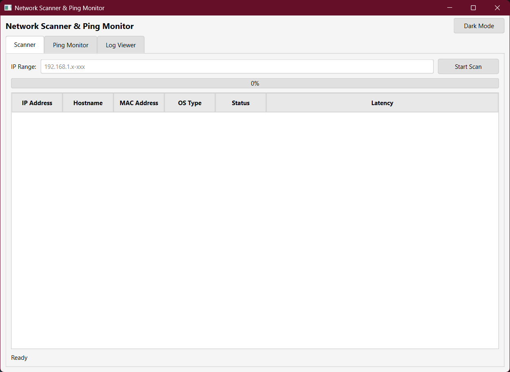
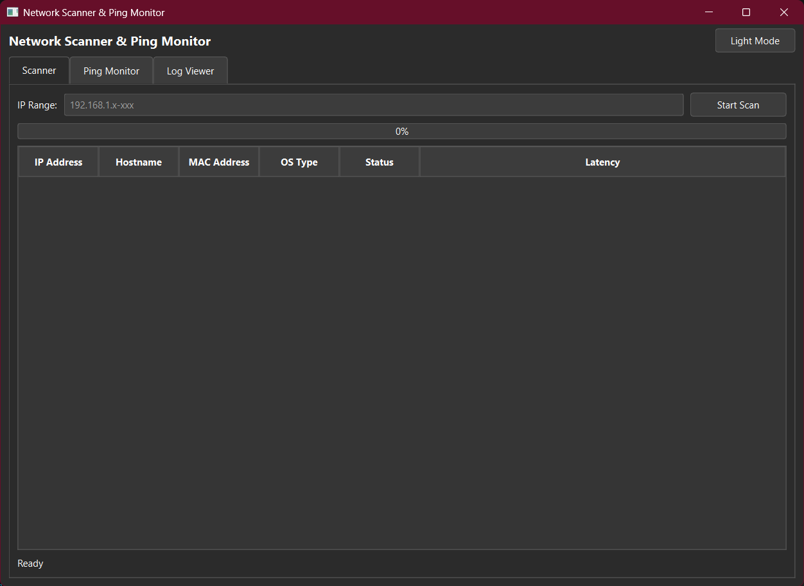

# 🌐 Network Scanner & Ping Monitor

<p align="center">
  
  
  
  
</p>

Aplikasi desktop untuk memindai perangkat pada jaringan lokal dan memantau ketersediaan (availability) perangkat secara berkala. Dibangun menggunakan **PySide6 (Qt for Python)** dengan antarmuka yang modern dan intuitif.

---

## 📋 Daftar Isi

- [Fitur Utama](#-fitur-utama)
- [Screenshot](#-screenshot)
- [Persyaratan Sistem](#-persyaratan-sistem)
- [Instalasi](#-instalasi)
- [Panduan Penggunaan](#-panduan-penggunaan)
- [Struktur Proyek](#-struktur-proyek)
- [Teknologi yang Digunakan](#-teknologi-yang-digunakan)
- [Kontributor](#-kontributor)
- [Lisensi](#-lisensi)

---

## ✨ Fitur Utama

### 1. 🔍 Network Scanner
- Memindai rentang IP untuk mendeteksi perangkat yang online
- Menampilkan informasi: IP Address, Hostname, MAC Address, OS Type, Status, Latency
- Mendukung format IP range fleksibel (contoh: `192.168.1.1-254`)
- Proses scan paralel menggunakan multithreading untuk performa optimal
- Progress bar real-time

### 2. 📡 Ping Monitor
- Memantau beberapa IP secara berkala dengan interval yang dapat diatur (1-300 detik)
- Menampilkan status real-time: Online/Offline dengan timestamp
- Mendukung penambahan IP dari hasil scan atau input manual
- Color coding untuk status (hijau = online, merah = offline)

### 3. 📊 Log Viewer
- Menyimpan semua hasil scan ke database SQLite
- Filter log berdasarkan: IP Address, Status (Online/Offline), Tanggal
- Export data ke format **CSV** dan **Excel (.xlsx)**
- Fitur hapus history log

### 4. 🎨 Fitur Tambahan
- **Dark Mode / Light Mode** - Toggle tema sesuai preferensi
- **Context Menu** - Klik kanan untuk aksi cepat (copy, add to monitor)
- **Keyboard Shortcuts** - Ctrl+A untuk select all
- **Multi-select** - Pilih beberapa IP sekaligus

---

## 📸 Screenshot

| Light Mode | Dark Mode |
|------------|-----------|
|  |  |

---

## 💻 Persyaratan Sistem

### Minimum Requirements
- **OS:** Windows 10/11 (64-bit)
- **RAM:** 4 GB
- **Storage:** 100 MB ruang kosong
- **Python:** 3.8 atau lebih baru (jika menjalankan dari source code)

### Dependencies
```
PySide6>=6.0.0
openpyxl>=3.0.0 (opsional, untuk export Excel)
```

---

## 🚀 Instalasi

### Metode 1: Menggunakan Executable (Recommended)

1. **Download** file `NetworkScanner.exe` dari folder `dist/`
2. **Jalankan** file executable tersebut
3. Aplikasi siap digunakan! ✅

> ⚠️ **Catatan:** Windows Defender mungkin memblokir file .exe yang baru dibuat. Klik "More info" → "Run anyway" jika muncul peringatan.

### Metode 2: Menjalankan dari Source Code

#### Langkah 1: Clone Repository
```bash
git clone https://github.com/USERNAME/network-scanner.git
cd network-scanner
```

#### Langkah 2: Buat Virtual Environment (Opsional tapi Disarankan)
```bash
# Membuat virtual environment
python -m venv venv

# Aktivasi virtual environment
# Windows:
venv\Scripts\activate
# Linux/Mac:
source venv/bin/activate
```

#### Langkah 3: Install Dependencies
```bash
pip install -r requirements.txt
```

#### Langkah 4: Jalankan Aplikasi
```bash
python main.py
```

### Metode 3: Build Executable Sendiri

```bash
# Install PyInstaller
pip install pyinstaller

# Build executable
pyinstaller NetworkScanner.spec

# atau build manual:
pyinstaller --onefile --windowed --icon=networkmodem_92597.ico --name=NetworkScanner main.py
```

File executable akan tersedia di folder `dist/`.

---

## 📖 Panduan Penggunaan

### 🔍 Tab Scanner - Memindai Jaringan

1. **Masukkan rentang IP** di field "IP Range"
   - Format single IP: `192.168.1.1`
   - Format range: `192.168.1.1-254`
   - Format short range: `192.168.1.10-20`

2. **Klik tombol "Start Scan"** untuk memulai pemindaian

3. **Tunggu proses scan selesai** - progress bar akan menunjukkan kemajuan

4. **Lihat hasil** - Tabel akan menampilkan semua perangkat yang ditemukan online

5. **Aksi tambahan** (klik kanan pada tabel):
   - ➕ Add to Ping Monitor - Tambahkan IP ke daftar monitoring
   - 📋 Copy - Salin IP address ke clipboard
   - ✅ Select All - Pilih semua baris

### 📡 Tab Ping Monitor - Memantau Perangkat

1. **Tambahkan IP yang ingin dipantau:**
   - Ketik IP di field "Monitor IP" → klik "Add to Monitor"
   - Atau klik kanan pada hasil scan → "Add to Ping Monitor"

2. **Atur interval monitoring** (default: 5 detik)

3. **Klik "Start Monitoring"** untuk memulai pemantauan

4. **Pantau status real-time:**
   - Status akan diperbarui setiap interval
   - Warna merah menandakan perangkat offline

5. **Untuk menghapus IP dari monitor:**
   - Pilih baris → klik "Remove from Monitor"
   - Atau klik kanan → "Remove from Monitor"

### 📊 Tab Log Viewer - Melihat History

1. **Filter log** menggunakan:
   - **Filter IP:** Ketik sebagian IP untuk mencari
   - **Status:** Pilih All/Online/Offline
   - **Date:** Pilih tanggal spesifik

2. **Clear Filters** untuk menghapus semua filter

3. **Export data:**
   - 📄 **Export to CSV** - Format CSV untuk spreadsheet
   - 📊 **Export to Excel** - Format .xlsx dengan styling

4. **Clear History** - Hapus semua log (dengan konfirmasi)

### 🎨 Dark Mode

- Klik tombol **"🌙 Dark Mode"** di pojok kanan atas
- Klik lagi **"☀️ Light Mode"** untuk kembali ke tema terang

### ⌨️ Keyboard Shortcuts

| Shortcut | Fungsi |
|----------|--------|
| `Ctrl+A` | Select all rows di tabel aktif |

---

## 📁 Struktur Proyek

```
Project_UAS/
│
├── main.py                 # Entry point aplikasi
├── requirements.txt        # Daftar dependencies
├── NetworkScanner.spec     # Konfigurasi PyInstaller
├── README.md               # Dokumentasi (file ini)
│
├── ui/                     # View - Antarmuka pengguna
│   ├── __init__.py
│   └── main_window.py      # Main window GUI
│
├── controllers/            # Controller - Logika bisnis
│   ├── __init__.py
│   └── scanner.py          # Scanner worker & logic
│
├── models/                 # Model - Database operations
│   ├── __init__.py
│   └── database.py         # SQLite database handler
│
├── config/                 # Konfigurasi
│   ├── __init__.py
│   └── constants.py        # Konstanta aplikasi
│
├── dist/                   # Folder executable hasil build
│   └── NetworkScanner.exe
│
└── build/                  # Folder build PyInstaller
```

### Arsitektur MVC

```
┌─────────────┐     ┌──────────────┐     ┌─────────────┐
│    View     │────▶│  Controller  │────▶│    Model    │
│ main_window │     │   scanner    │     │  database   │
│   (GUI)     │◀────│   (Logic)    │◀────│  (SQLite)   │
└─────────────┘     └──────────────┘     └─────────────┘
```

---

## 🛠️ Teknologi yang Digunakan

| Teknologi | Kegunaan |
|-----------|----------|
| **Python 3.x** | Bahasa pemrograman utama |
| **PySide6 (Qt)** | Framework GUI |
| **SQLite3** | Database lokal |
| **QThreadPool** | Multithreading untuk scan paralel |
| **subprocess** | Menjalankan perintah ping & arp |
| **socket** | DNS lookup untuk hostname |
| **openpyxl** | Export ke format Excel |
| **PyInstaller** | Build executable |

---

## 🔧 Troubleshooting

### Aplikasi tidak bisa di-scan
- Pastikan menjalankan sebagai **Administrator**
- Nonaktifkan firewall sementara untuk testing
- Pastikan IP range yang dimasukkan valid

### Export Excel tidak berfungsi
- Install module openpyxl: `pip install openpyxl`

### Antivirus memblokir .exe
- Tambahkan exception untuk file NetworkScanner.exe
- Atau jalankan dari source code

### Hostname tidak terdeteksi
- Beberapa perangkat mungkin tidak memiliki reverse DNS
- Firewall perangkat target mungkin memblokir request

---

## 👨‍💻 Kontributor

| Nama | NIM | Kelas |
|------|-----|-------|
| [Nama Anda] | [NIM Anda] | [Kelas Anda] |

**Dosen Pengampu:** Safri Adam, S.Kom., M.Kom.  
**Mata Kuliah:** Praktikum Pemrograman Visual  
**Politeknik Negeri Pontianak** - Tahun Akademik 2025/2026

---

## 📄 Lisensi

Proyek ini dibuat untuk keperluan tugas akhir mata kuliah Praktikum Pemrograman Visual.

---

<p align="center">
  Made with ❤️ using Python & PySide6
</p>
